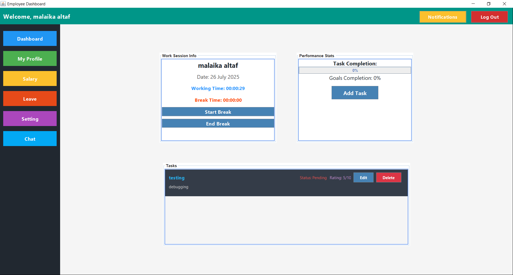
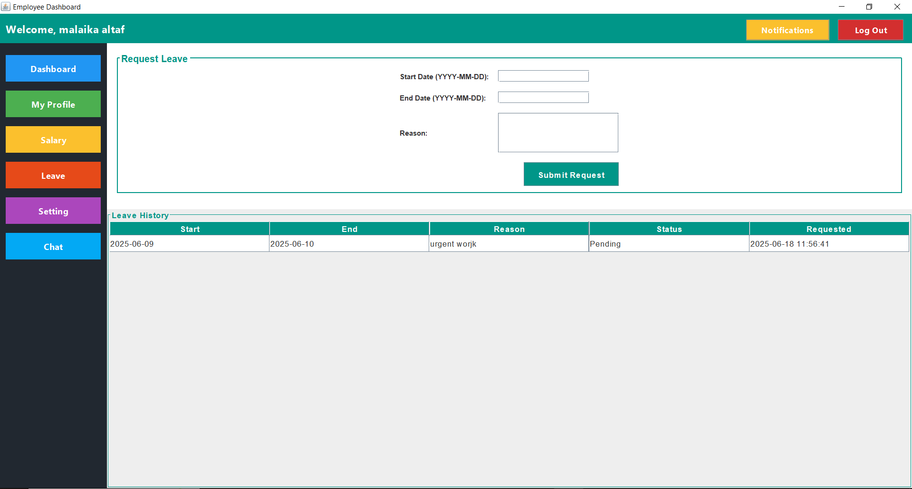

````markdown
# 🧑‍💼 Employee Management System – Java + MySQL

A desktop-based Employee Management System built as a semester project using **Java (Swing, AWT)** and **MySQL**, following the **MVC architecture**. This system supports both Admin and Employee roles and streamlines HR operations like profile management, time tracking, salary viewing, leave requests, and real-time chat.

---

## 📌 Features

### ✅ **Admin Dashboard**
- View and manage employee records
- Approve or reject leave requests
- View salary details of all employees
- Access settings (theme toggle, email update)
- Real-time chat with employees

### ✅ **Employee Dashboard**
- View personal profile with image upload
- Track working hours and breaks in real time
- Request leaves and view status
- View detailed salary breakdown
- Real-time chat with admin
- Light/Dark mode toggle (saved per user)
- Update email address

---

## 💡 Tech Stack

| Technology        | Description                          |
|------------------|--------------------------------------|
| **Java (Swing)** | GUI Development                      |
| **AWT**          | Event handling & UI enhancements     |
| **MySQL**        | Relational Database                  |
| **JDBC**         | Database Connectivity                |
| **MVC Pattern**  | Clean separation of concerns         |
| **Socket Programming** | Real-time chat communication      |
| **File Handling** | Image upload for employee profiles   |

---

## 📸 UI Screenshots

| Admin Dashboard | Employee Dashboard |
|-----------------|--------------------|







## 🛠️ Installation & Setup

1. **Clone the repository**:
   ```bash
   git clone https://github.com/your-username/employee-management-system.git
````

2. **Open the project in VS Code or any Java IDE**.

3. **Set up the MySQL Database**:

   * Create a database: `ems1`
   * Import the provided SQL script from `/database/ems1.sql`

4. **Configure DB connection** in `DBConnection.java`:

   ```java
   String url = "jdbc:mysql://localhost:3306/ems1";
   String user = "root";
   String password = "your_password";
   ```

5. **Run the application** from `Main.java`.

---

## 🧪 Project Modules

* `model/` – Handles data fetching, insertion, and logic
* `view/` – Java Swing GUI components
* `controller/` – Action listeners and control logic
* `chat/` – Real-time chat server and client
* `util/` – DBConnection and helper utilities

---

## ✨ Highlights

* Clean UI using Swing + AWT
* Real-time working timer
* Profile photo upload & display
* Chat system using sockets
* Light/Dark theme preferences stored in DB
* Well-structured following OOP & MVC

---


```

---


